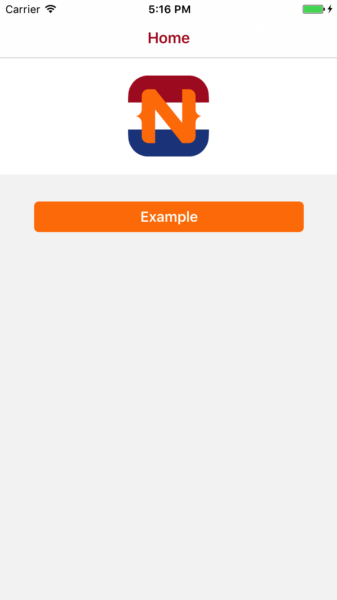

##Example of a multilingual NativeScript app with Angular 4


####Instructions

```
git clone --depth 1 https://github.com/nativescriptnl/NSNL_Multilingual4 projectname
cd projectname
rm -rf .git
git init
npm install
tns platform add ios
tns livesync ios --watch
```


